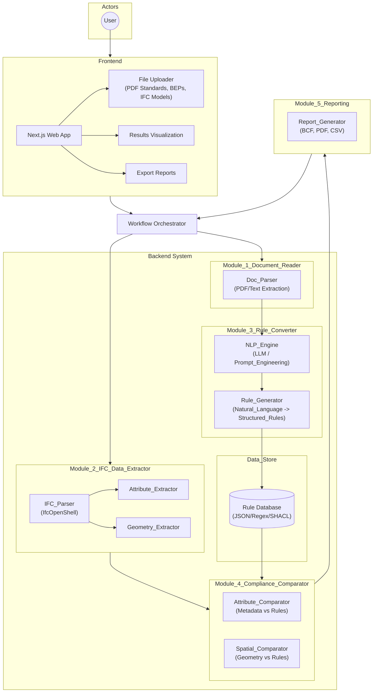
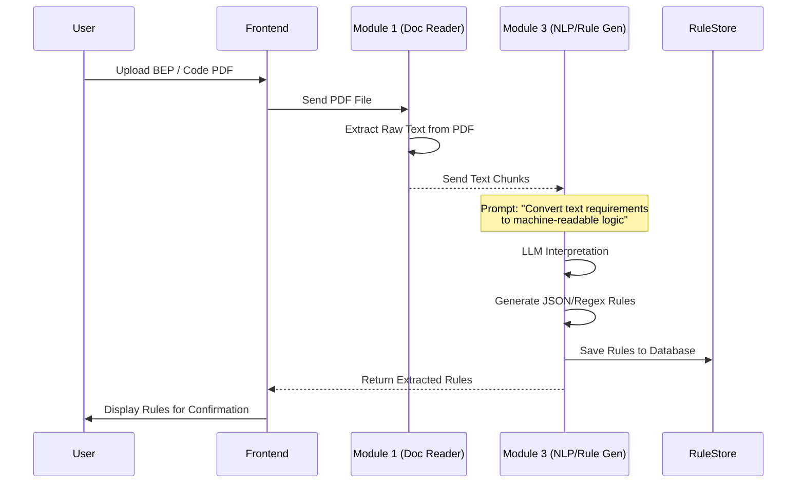
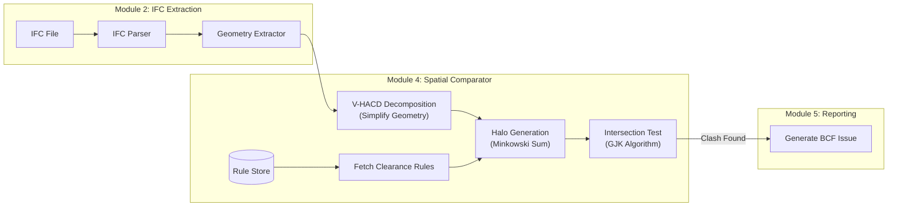
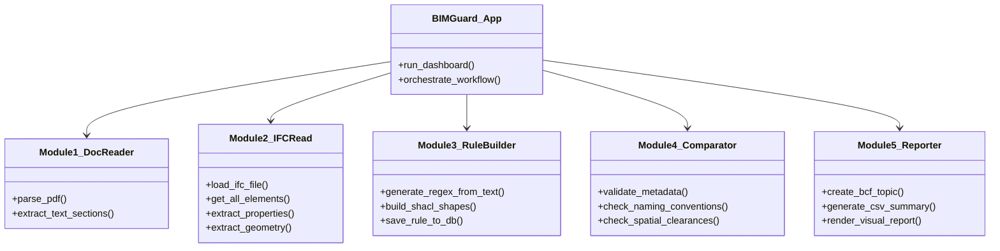

# BIMGuard AI System Architecture

This document visualizes the system architecture for **BIMGuard AI**. It is structured around five core functional modules that automate the transition from static requirements to digital compliance.

## 1. High-Level System Architecture

This diagram illustrates the system flow, categorized into the five requested modules: **(1) Document Reader**, **(2) IFC Reader**, **(3) Rule Converter**, **(4) Comparator**, and **(5) Reporting**.

## 2. Module 1 & 3: Rule Extraction Workflow (Sequence)

This sequence details how the system reads documents (Module 1) and converts them into rules (Module 3).

## 3. Module 2 & 4: Compliance Checking Flow (Geometry)

This flow details the geometric analysis, where IFC data (Module 2) is checked against rules (Module 4).

## 4. Implementation Stack (Class Structure)

Below is the recommended codebase structure, organized by the five modules.

