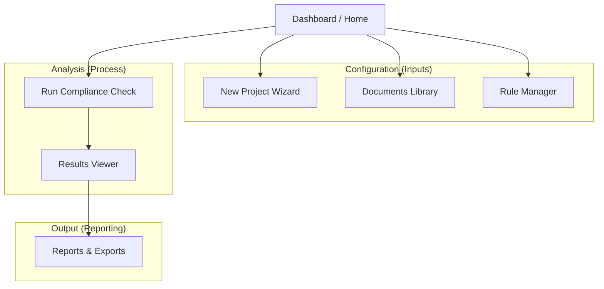

# UX/UI Design Specification: BIMGuard AI

**Version:** 1.0
**Based on:** `system_architecture.md`
**Target Audience:** Frontend Team, UI Designers

---

## 1. Executive Summary

**BIMGuard AI** is a compliance automation platform. The UI must facilitate a complex technical workflow (Document Reading -> Rule Generation -> IFC Checking -> Reporting) with a simple, user-friendly interface. The design philosophy is **"Transparent Automation"**—users should see the AI working but always have the final say (Human-in-the-Loop).

## 2. Information Architecture (Sitemap)

The application is structured around a central **Dashboard** with distinct flows for **Configuration** (Inputs) and **Analysis** (Outputs).

### Core Navigation (Sidebar/Top Bar)

1. **Dashboard**: High-level project health and recent activity.
2. **My Projects**: List of ongoing validation projects.
3. **Library**:
    * **Documents**: Uploaded BEPs, Codes, Standards.
    * **Rule Sets**: Extracted and curated rules.
4. **Settings**: User profile, API keys, etc.

---

## 3. User Flows

### Flow 1: Insight Ingestion (Document -> Rule)

This flow corresponds to **Module 1 (Doc Reader)** and **Module 3 (Rule Converter)**.

1. **Upload**: User uploads a PDF (e.g., "ISO 19650 Naming Convention").
2. **Processing**: System shows a progress bar ("Reading Document...", "Extracting Logic...").
3. **Review (Human-in-the-Loop)**:
    * System presents a split-screen view: **Original PDF Text** (left) vs. **Extracted Rule** (right).
    * User validates: "Yes, this Regex matches the requirement."
4. **Save**: Validated rules are saved to the **Rule Store**.

### Flow 2: Compliance Check (IFC + Rules -> Result)

This flow corresponds to **Module 2 (IFC Extractor)** and **Module 4 (Comparator)**.

1. **Select Project**: User chooses a workspace.
2. **Upload Model**: User uploads an IFC file.
3. **Select Rules**: User checks which Rule Sets to apply (e.g., "BEP Naming" + "Fire Safety Code").
4. **Run Analysis**: System processes geometry and attributes.
5. **Notification**: "Check Complete. 15 Issues Found."

### Flow 3: Analysis & Reporting

This flow corresponds to **Module 5 (Reporting)**.

1. **Results Dashboard**:
    * **Summary Cards**: Total Elements Checked, Pass Rate %, Critical Failures.
    * **Category Breakdown**: Walls, Doors, Windows, etc.
2. **Detailed Review**:
    * User clicks a failure item.
    * **3D Viewer** activates, zooming to the element.
    * **Halo Visualization**: Shows the required clearance volume vs. actual clearance.
3. **Export**:
    * User selects confirmed issues.
    * Clicks "Export BCF".

---

## 4. Screen Specifications (Wireframes)

### 4.1. The Dashboard (Home)

**Layout:** Grid System

* **Header**: "Welcome, [User]". Quick Action Button: `[+ New Compliance Check]`
* **Stats Panel**:
  * Projects Active
  * Total Issues Found (This Week)
  * Average Compliance Score
* **Recent Activity List**:
  * "Hospital Block A.ifc" - *Processing...*
  * "BEP_v2.pdf" - *Rules Extracted*
  * "Office_Tower.ifc" - *Check Completed (85%)*

### 4.2. Rule Extraction Studio (The "AI Brain")

**Layout:** Two-Column Split View (The "Diff" View)

* **Left Panel (Source)**: PDF Viewer highlighting the specific paragraph being analyzed.
* **Center**: Arrow / Transformation Icon.
* **Right Panel (Result)**: Form fields for the created rule.
  * *Rule Name*: "Wall Naming Convention"
  * *Category*: `IfcWall`
  * *Logic*: `Regex: [A-Z]{3}-[0-9]{2}`
  * *Confidence Score*: 92% (Green Badge)
* **Actions**: `[Approve]`, `[Edit]`, `[Reject]`

### 4.3. Compliance Viewer (The 3D Result)

**Layout:** "IDE" Style Layout

* **Left Sidebar (Browser)**: Tree view of issues.
  * `▼ Critical (5)`
    * `▶ Wall W-102 (Clearance Violation)`
  * `▼ Warning (12)`
    * `▶ Door D-05 (Naming Error - "Fuzzy Match")`
* **Main Area (3D Canvas)**:
  * Interactive `IfcOpenShell` / `Three.js` viewer.
  * **Visuals**: The failing element is red. The "Halo" (phantom clearance zone) is semi-transparent yellow.
* **Right Panel (Inspector)**:
  * **Issue Details**: "Clash Detected. Required: 50mm, Actual: 10mm."
  * **Source Rule**: Link back to the PDF text ("Per Building Code Section 4.5").
  * **Action**: `[Mark as False Positive]` `[Add to BCF]`

### 4.4. UI Components (Technical Mapping)

| UI Element | Shadcn Component | Icons (Lucide) |
| :--- | :--- | :--- |
| **Progress** | `<Progress />` | `Loader2` (animate-spin) |
| **Dialogs** | `<Dialog />` | `AlertCircle`, `CheckCircle` |
| **Dropdowns** | `<DropdownMenu />` | `ChevronDown`, `MoreVertical` |
| **Tabs** | `<Tabs />` | `Layout`, `List` |
| **Toast** | `sonner` | `Bell` |

---

## 5. UI Component Guidelines

* **Color Palette**:
  * **Primary**: Deep Blue (Professional, Trust).
  * **Pass**: Emerald Green.
  * **Fail**: Crimson Red.
  * **Warning**: Amber.
  * **AI Actions**: Purple/Violet gradient (to distinguish AI suggestions from hard rules).
* **Color Palette**:
  * **Primary**: Deep Blue (Professional, Trust).
  * **Pass**: Emerald Green.
  * **Fail**: Crimson Red.
  * **Warning**: Amber.
  * **AI Actions**: Purple/Violet gradient (to distinguish AI suggestions from hard rules).
* **Typography**: Clean sans-serif (Inter or Roboto). Monospace for Code/Regex.
* **Feedback**:
  * Use skeleton loaders for IFC processing.
  * Use toast notifications for background tasks ("Rule Extraction Complete").

## 6. Technical Considerations for Frontend

### 6.1. Tech Stack

* **Framework**: **Next.js 16.1.6** (App Router) for performance and latest React features.
* **Styling**: **Tailwind CSS v4** with `@tailwindcss/postcss`.
* **UI Library**: **Shadcn UI** (@radix-ui primitives) + `lucide-react` icons.
* **BIM Engine**: **@thatopen/components** (v3.3) & **@thatopen/fragments** via `web-ifc`.
* **3D Rendering**: `three.js` (managed via That Open Engine).

### 6.2. Architecture Patterns (SOLID)

* **Services Layer**: Business logic resides in `services/` (e.g., `CameraService`, `FragmentsService`).
* **Dependency Injection**: Services must implement interfaces defined in `types/`.
* **Composition**: Components (e.g., `ViewerToolbar`) are composed into the main `IFCViewer`.
* **Hooks**: Use `useBIMViewer` to access initializing logic and service instances.

### 6.3. State Management

* **React Context**: `BIMContext.tsx` for providing access to initialized services.
* **Refs**: Use `useRef` for stable access to service instances (e.g., `viewerRef`) to prevent unnecessary re-renders.
