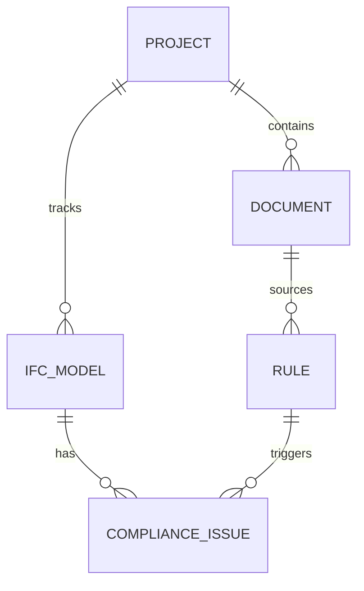

# Data Model: Unified Compliance Engine

**Branch**: `003-unified-compliance-engine` | **Date**: 2026-03-11

## Entities

### Document
Represents a source of compliance truth (BEP, Code, Standard).

| Field | Type | Description |
|-------|------|-------------|
| `id` | UUID | Unique identifier |
| `name` | string | Filename/Title |
| `type` | enum | `BEP`, `BUILDING_CODE`, `CLIENT_STANDARD` |
| `raw_text` | string | Full text extracted from PDF |
| `uploaded_at` | datetime | Timestamp |

### Rule
A machine-executable constraint derived from a Document.

| Field | Type | Description |
|-------|------|-------------|
| `id` | UUID | Unique identifier |
| `document_id` | UUID | Link to source Document |
| `category` | string | Target IFC Class (e.g., `IfcWall`) |
| `logic` | dict/JSON | Logic definitions (Regex, Thresholds, Offset values) |
| `type` | enum | `METADATA`, `SPATIAL`, `NOMENCLATURE` |
| `confidence` | float | AI confidence score (0-1) |
| `is_approved` | boolean | Human-in-the-loop status |

### ComplianceIssue
A specific violation detected in an IFC Model.

| Field | Type | Description |
|-------|------|-------------|
| `id` | string | Key (e.g., ISSUE-001) |
| `type` | enum | `METADATA_MISSING`, `NAMING_VIOLATION`, `CLEARANCE_VIOLATION` |
| `element_id` | string | IFC GlobalId |
| `description` | string | Human-readable explanation |
| `viewpoint` | JSON | Camera position and orientation (for BCF) |
| `status` | enum | `OPEN`, `RESOLVED`, `FALSE_POSITIVE` |

## Relationships

